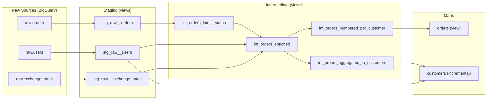
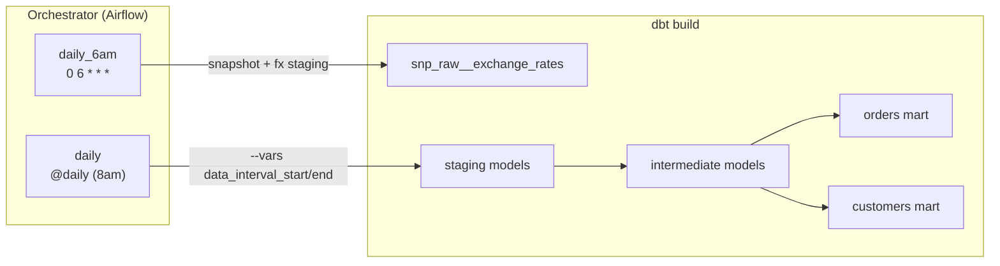

# Airalo dbt

dbt project for Airalo eSIM order and customer analytics, targeting BigQuery.

> **Written response:** [RESPONSE.md](RESPONSE.md) — covers approach, assumptions, data quality issues, and the cleaning vs business logic boundary.

## Overview



### Architecture

| Layer | Materialization | Purpose |
|---|---|---|
| **Staging** | Views | 1:1 with source tables. Renaming, casting, light filtering. No joins. |
| **Intermediate** | Views | Business logic: deduplication, currency conversion, purchase sequencing, customer aggregation. |
| **Marts** | Table / View | Published BI interface. `customers` is an incremental merge; `orders` is a view over `int_orders_numbered_per_customer`. |

### Key design decisions

- **Incremental customers mart** — merges on `user_id` using `data_interval_start`/`data_interval_end` vars passed by the orchestrator. Only recomputes customers whose orders changed in the batch window.
- **Exchange rate snapshot** — `snp_raw__exchange_rates` tracks rate changes via `check` strategy so historical orders can be converted at the rate that was current when they were placed.
- **Purchase sequencing** — `int_orders_numbered_per_customer` assigns each customer a `customer_purchase_number` and computes `days_since_previous_purchase`, enabling repeat-purchase analysis without post-hoc queries.
- **BI-layer metrics** — `_customers.yml` and `_orders.yml` define Lightdash-compatible metrics (`repeat_purchaser_rate`, `new_customer_rate`, `avg_days_to_second_purchase`, etc.) so dashboards derive from governed definitions.

## Prerequisites

- [UV](https://docs.astral.sh/uv/getting-started/installation/) (Python package manager)
- Google Cloud credentials configured for BigQuery access

## Getting started

```bash
# Install dependencies (creates a virtual environment automatically)
uv sync

# Install dbt packages
uv run dbt deps

# Verify your connection
uv run dbt debug
```

### Environment variables

| Variable | Required | Description |
|---|---|---|
| `data_interval_start` | For incremental runs | Start of the processing window (ISO timestamp). Passed via `--vars`. |
| `data_interval_end` | For incremental runs | End of the processing window (ISO timestamp). Passed via `--vars`. |

Development defaults are set in `dbt_project.yml` so `dbt run` works without vars.

## Running the project

```bash
# Full run (all models)
uv run dbt build

# Run a specific model and its upstream dependencies
uv run dbt build --select +customers

# Run only staging models
uv run dbt build --select staging

# Full refresh of incremental models (rebuild from scratch)
uv run dbt build --full-refresh --select customers

# Incremental run with a specific time window
uv run dbt build --select customers --vars '{data_interval_start: "2025-01-15", data_interval_end: "2025-01-16"}'

# Run tests only
uv run dbt test

# Generate and serve docs
uv run dbt docs generate && uv run dbt docs serve
```

## Project structure

```
.
├── dbt_project.yml
├── packages.yml                  # dbt_utils, dbt_project_evaluator
├── schedules.yml                 # Airflow DAG schedule definitions
├── seeds/
│   └── seed_countries.csv        # ISO country code → name mapping
├── snapshots/
│   └── snp_raw__exchange_rates   # SCD-2 tracking of USD rates
├── macros/
│   ├── convert_to_usd.sql        # Currency conversion macro
│   └── generate_schema_name.sql  # Custom schema naming
├── models/
│   ├── staging/
│   │   ├── _raw__sources.yml     # Source definitions + freshness
│   │   ├── stg_raw__orders.sql
│   │   ├── stg_raw__users.sql
│   │   └── stg_raw__exchange_rates.sql
│   ├── intermediate/
│   │   ├── int_orders_latest_status.sql
│   │   ├── int_orders_enriched.sql
│   │   ├── int_orders_numbered_per_customer.sql
│   │   └── int_orders_aggregated_to_customers.sql
│   └── marts/
│       ├── orders.sql            # View — BI interface for order-grain
│       ├── _orders.yml           # Column docs + Lightdash metrics
│       ├── customers.sql         # Incremental — customer-grain
│       └── _customers.yml        # Column docs + Lightdash metrics
└── reports/
    └── customer_purchase_behavior.ipynb  # Example queries and analysis
```

## Scheduling

Schedule definitions live in `schedules.yml`. Each entry becomes an Airflow DAG. Models are assigned to schedules via tags in their `config()` block.



| DAG | Schedule | What runs | Why |
|---|---|---|---|
| `daily_6am` | 6am UTC | Exchange rate snapshot + staging | Ensures current FX rates before orders are processed |
| `daily` | 8am UTC (`@daily`) | Full project (excl. other tags) | Main incremental run with orchestrator-provided time window |
| `adhoc` | Manual only | Tagged models | Backfills and debugging |

### Passing variables from Airflow

The orchestrator passes the processing window as dbt vars:

```bash
dbt build --vars '{data_interval_start: "{{ ds }}", data_interval_end: "{{ next_ds }}"}'
```

The `customers` mart uses these to identify which customers need recomputation, avoiding a full table scan on every run.

## Example analysis

[`reports/customer_purchase_behavior.ipynb`](reports/customer_purchase_behavior.ipynb) demonstrates how the marts can be queried to answer business questions using the columns and metrics defined in `_customers.yml` and `_orders.yml`:

1. **Where to focus marketing spend** — new vs returning customer revenue split, repeat rates by acquisition channel
2. **How often customers return** — purchase frequency distribution, repeat purchaser rate
3. **How long until they come back** — time-to-second-purchase distribution, inter-purchase gap trends

## Testing

Tests are defined in YAML configs alongside models. The project uses:

- **Generic tests** — `unique`, `not_null`, `relationships`, and `expression_is_true` on key columns and derived values
- **Unit tests** — mock-data tests validating business logic (dedup, USD conversion, purchase sequencing, customer derived columns)
- **Source freshness** — `warn_after: 36h`, `error_after: 72h` on raw tables
- **dbt_project_evaluator** — validates project structure against dbt best practices

```bash
# Run all tests
uv run dbt test

# Test a specific model
uv run dbt test --select customers

# Check source freshness
uv run dbt source freshness
```

## Resources

- [dbt documentation](https://docs.getdbt.com/docs/introduction)
- [dbt Discourse](https://discourse.getdbt.com/)
- [dbt Slack](http://slack.getdbt.com/)
- [Lightdash metrics layer](https://docs.lightdash.com/guides/how-to-create-metrics/)
